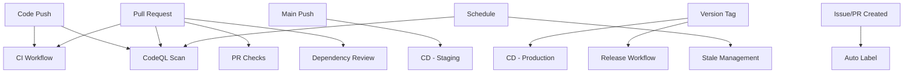

# Workflow Status Dashboard

This document provides a quick reference for all GitHub Actions workflows in the Epitrello project.

## Workflow Overview

| Workflow | Status | Trigger | Purpose |
|----------|--------|---------|---------|
| CI | [](https://github.com/mpJunot/Epitrello/actions/workflows/ci.yml) | Push/PR to main/develop | Lint, build, test, quality checks |
| CodeQL | [](https://github.com/mpJunot/Epitrello/actions/workflows/codeql.yml) | Push/PR/Schedule | Security vulnerability scanning |
| CD | [](https://github.com/mpJunot/Epitrello/actions/workflows/cd.yml) | Push to main/tags | Deploy to staging/production |
| Dependency Review | - | PR to main/develop | Review dependency vulnerabilities |
| PR Checks | - | PR events | Validate PR format and size |
| Release | - | Version tags | Create releases and publish |
| Stale | - | Daily schedule | Mark and close stale issues/PRs |
| Auto Label | - | Issue/PR events | Automatically label issues/PRs |

## Workflow Details

### 🔄 CI Workflow

**File**: `.github/workflows/ci.yml`

**Purpose**: Ensure code quality and functionality through automated checks

**Jobs**:
- ✅ **Lint**: ESLint checks (Node 20)
- 🏗️ **Build**: Compile application (Node 20)
- 🧪 **Test**: Run tests (Node 18, 20, 22)
- 📊 **Code Quality**: Type checks and formatting (Node 20)

**Runtime**: ~5-10 minutes

**Artifacts**:
- Build output (`dist/`, `build/`)
- Code coverage reports

**Common Failures**:
- Linting errors
- Type errors
- Test failures
- Build errors

---

### 🔒 CodeQL Security Scan

**File**: `.github/workflows/codeql.yml`

**Purpose**: Detect security vulnerabilities in code

**Jobs**:
- 🔍 **Analyze**: Scan JavaScript/TypeScript code

**Runtime**: ~3-5 minutes

**Scan Types**:
- Security vulnerabilities
- Code quality issues
- Best practice violations

**Schedule**: Weekly on Mondays + every push/PR

**Alert Locations**: Security tab → Code scanning

---

### 🚀 CD Workflow

**File**: `.github/workflows/cd.yml`

**Purpose**: Automated deployment to environments

**Jobs**:
- 🧪 **Deploy Staging**: Auto-deploy to staging (on main push)
- 🚢 **Deploy Production**: Deploy to production (on version tags)
- 🐳 **Docker Build**: Build and push Docker images

**Environments**:
- `staging`: Auto-deploy from main
- `production`: Manual deploy via tags

**Docker Images**:
- Tagged with: branch name, semver, commit SHA
- Pushed to Docker Hub

**Required Secrets**:
- `DOCKER_USERNAME`
- `DOCKER_PASSWORD`

---

### 🔍 Dependency Review

**File**: `.github/workflows/dependency-review.yml`

**Purpose**: Prevent vulnerable dependencies from being merged

**Jobs**:
- 📦 **Review**: Check dependencies in PRs

**Features**:
- Fails on moderate+ severity
- Comments on PR with findings
- Links to vulnerability details

**Runtime**: ~1-2 minutes

---

### ✓ PR Checks

**File**: `.github/workflows/pr-checks.yml`

**Purpose**: Validate pull request quality and format

**Jobs**:
- 📝 **Validate PR**: Check title format, merge conflicts, branch naming
- 📏 **Size Label**: Add size labels based on changes

**PR Title Format**:
```
<type>(<scope>): <description>

Examples:
feat(board): add filtering
fix(auth): resolve token issue
docs: update README
```

**Size Labels**:
- `size/xs`: ≤10 lines
- `size/s`: ≤100 lines
- `size/m`: ≤500 lines
- `size/l`: ≤1000 lines
- `size/xl`: >1000 lines

---

### 📦 Release Workflow

**File**: `.github/workflows/release.yml`

**Purpose**: Automate release creation and publishing

**Jobs**:
- 🎉 **Create Release**: Generate changelog and create release

**Features**:
- Automatic changelog from commits
- Release notes generation
- Artifact uploads
- npm publishing (optional)

**Trigger**:
```bash
git tag v1.0.0
git push origin v1.0.0
```

**Outputs**:
- GitHub Release
- npm package (if configured)
- Release assets

---

### 🧹 Stale Management

**File**: `.github/workflows/stale.yml`

**Purpose**: Clean up inactive issues and PRs

**Schedule**: Daily at midnight UTC

**Timeframes**:
- **Issues**:
  - Stale after: 60 days
  - Close after: 7 days (stale)
- **PRs**:
  - Stale after: 45 days
  - Close after: 14 days (stale)

**Exempt Labels**:
- `pinned`
- `security`
- `priority`
- `work-in-progress` (PRs only)

**Actions**:
1. Add `stale` label
2. Post comment
3. Close if no activity

---

### 🏷️ Auto Label

**File**: `.github/workflows/auto-label.yml`

**Purpose**: Automatically categorize issues and PRs

**Triggers**:
- Issue opened/edited
- PR opened/edited/synchronized

**Issue Labels**:
- `bug`: Issues with [Bug] in title
- `enhancement`: Issues with [Feature] in title

**PR Labels** (based on changed files):
- `documentation`: `*.md`, `docs/**`
- `dependencies`: `package.json`, lockfiles
- `ci`: `.github/**`
- `tests`: `*.test.*`, `*.spec.*`
- `frontend`: `components/**`, `pages/**`
- `backend`: `api/**`, `services/**`
- `database`: `database/**`, `migrations/**`
- `security`: `auth/**`, `security/**`
- `configuration`: Config files

---

## Workflow Dependencies



## Quick Actions

### Run Workflow Manually

1. Go to **Actions** tab
2. Select workflow from left sidebar
3. Click **Run workflow** button
4. Select branch and inputs (if any)
5. Click **Run workflow**

### View Workflow Logs

1. Go to **Actions** tab
2. Click on workflow run
3. Click on job name
4. Expand steps to view logs

### Cancel Running Workflow

1. Go to **Actions** tab
2. Click on running workflow
3. Click **Cancel workflow** button

### Re-run Failed Workflow

1. Go to **Actions** tab
2. Click on failed workflow
3. Click **Re-run jobs** → **Re-run all jobs**

## Monitoring

### Key Metrics to Track

1. **CI Success Rate**: % of passing CI runs
2. **Average Build Time**: Time to complete CI
3. **Test Coverage**: % of code covered by tests
4. **Security Alerts**: Open vulnerability count
5. **Deployment Frequency**: Deployments per week
6. **Mean Time to Deploy**: Time from commit to production

### Health Indicators

🟢 **Healthy**:
- CI passing consistently
- No security alerts
- Deployments successful
- Fast build times (<10 min)

🟡 **Warning**:
- Occasional CI failures
- Low security alerts
- Slow builds (10-20 min)
- Deployment issues

🔴 **Critical**:
- Frequent CI failures
- High/critical security alerts
- Very slow builds (>20 min)
- Deployment blocked

## Troubleshooting

### Workflow Won't Trigger

**Possible Causes**:
- Incorrect branch name
- Workflow disabled
- Insufficient permissions
- YAML syntax error

**Solutions**:
1. Check workflow trigger configuration
2. Verify workflow is enabled
3. Validate YAML syntax
4. Check repository permissions

### Workflow Stuck/Running Too Long

**Possible Causes**:
- Hanging tests
- Network issues
- Resource constraints

**Solutions**:
1. Cancel and re-run
2. Check for infinite loops
3. Add timeouts to jobs
4. Investigate logs

### Secrets Not Working

**Possible Causes**:
- Secret not set
- Incorrect secret name
- Wrong environment

**Solutions**:
1. Verify secret exists in Settings → Secrets
2. Check spelling in workflow
3. Ensure environment matches

## Best Practices

### For Contributors

1. ✅ Run tests locally before pushing
2. ✅ Follow commit conventions
3. ✅ Keep PRs small and focused
4. ✅ Address CI failures promptly
5. ✅ Review workflow logs when failures occur

### For Maintainers

1. ✅ Monitor workflow success rates
2. ✅ Review security alerts weekly
3. ✅ Keep actions versions updated
4. ✅ Optimize slow workflows
5. ✅ Document workflow changes

## Useful Commands

```bash
# View workflow status
gh workflow list

# View specific workflow runs
gh run list --workflow=ci.yml

# View logs for a run
gh run view <run-id> --log

# Re-run a failed workflow
gh run rerun <run-id>

# Watch a running workflow
gh run watch <run-id>
```

## Resources

- [GitHub Actions Documentation](https://docs.github.com/en/actions)
- [Workflow Syntax](https://docs.github.com/en/actions/reference/workflow-syntax-for-github-actions)
- [GitHub CLI](https://cli.github.com/manual/gh_workflow)
- [CI/CD Guide](./CI_CD_GUIDE.md)

---

**Last Updated**: November 2025

For detailed workflow configuration and troubleshooting, see [CI/CD Guide](./CI_CD_GUIDE.md).
